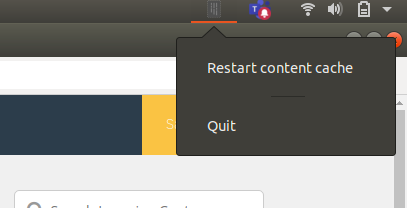

# Recache
Restart fusion cache

<p align="center">
    
</p>

So this is a tiny tool i built out of necessity in order to help me speed things up in my job, what it does 
is basically it lets me restart a docker container with just a couple of clicks in the system tray. 
As i work with an engine called fusion based on JAMstack which leverages react library for rendering and it kind of has a docker container inside which among other 
things cache its api content i need a way to somewhat reset this functionality during development to get things done faster.

<table border="0" cellspacing="0" cellpadding="0" style="border-collapse: collapse; border: none;">
  <tr>
    <td></td>
    <td></td>
    <td></td>
    <td></td>
    <td></td>
  </tr>
</table>

## How to build it :rocket: 

Install these dependencies

```console
foo@bar:~$ sudo apt install libappindicator3-dev gir1.2-appindicator3-0.1
```

Clone the repo

```console
foo@bar:~$ git clone https://github.com/wwleak/recache.git
```

Change directory into the src folder

```console
foo@bar:~$ cd recache/src
```

Run the build command as follows

```console
foo@bar:~$ go build -o ../bin/recache
```

That's it. The binary file will be located inside the bin folder
